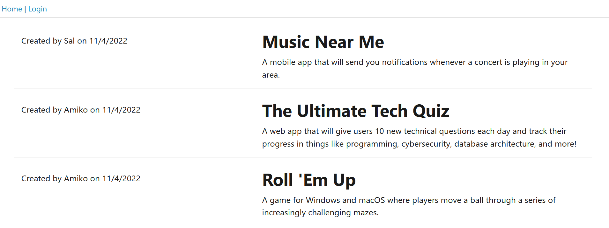
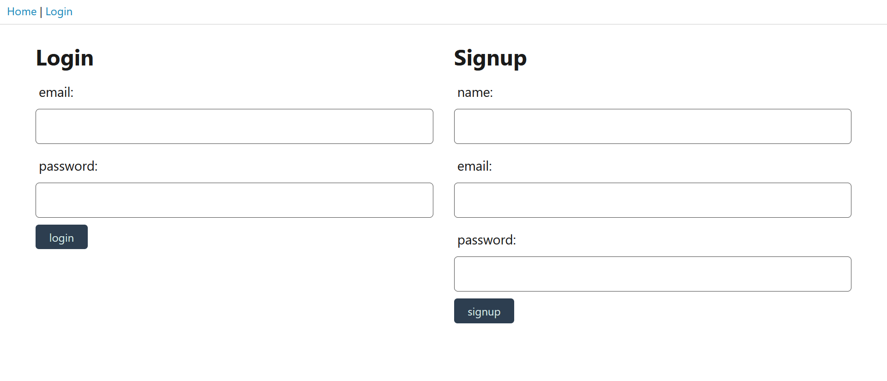
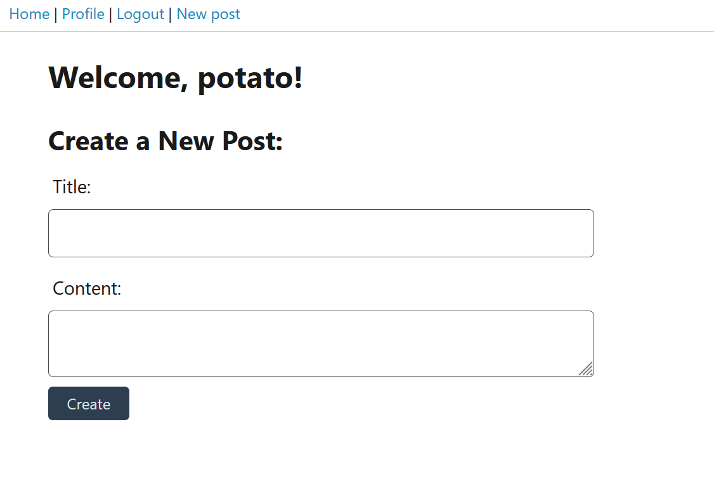

# Blog Database

## Introduction

A simple blog site with logins and authorization.

## Table of Contents 
1. [Installation](#installation)
2. [Usage](#usage)
3. [Test](#test)
4. [Images](#images)
5. [Credits](#credits)
6. [Licenses](#licenses)

## Installation 

1. Clone the repository into the destination folder from the repository, https://github.com/EllisJLC/Blogs.
2. Run `npm install` in the repository directory to install the necessary node packages. 
3. Run node seeds/seed.js to seed data.

## Usage

A simple site to post blogs.

## Test

1. Locally, run the command `npm start` to start the program. 
2. Navigate to the necessary port in localhost. 

Launched on the site, https://blogdb13011.herokuapp.com/.

## Images

### Homepage

### Login

### Post New Blog

## Credits

Code was written by Jia Liang (Ellison) Chen.

## Licenses 

The MIT License: https://opensource.org/licenses/MIT